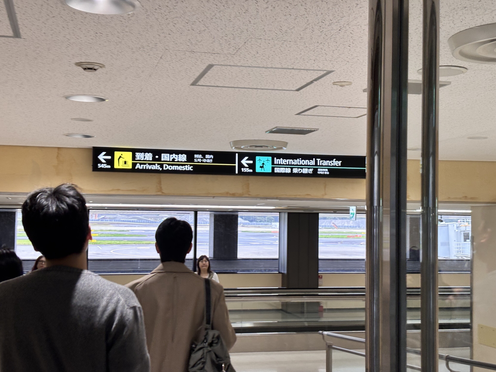
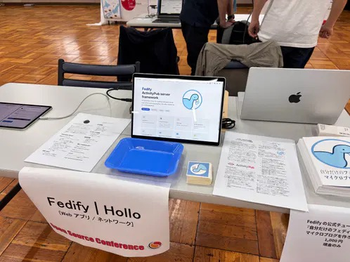

<!-- _class: lead-->

# 適当言ってたら海外から開発者が来た話
Esurio(@esurio1673@c.koliosky.com)

---

# 自己紹介

```json
{
    "name": "Esurio",
    "account": "@esurio1673@c.koliosky.com",
    "jobs": "student",
    "distribution": "Ubuntu, Debian, Fedora",
    "language": "Typescript, Rust"
}
```

---

# 元凶
 
 私が適当な発言をしたのが全ての始まり
> 来春のOSCでHolloのブースとかあっても良さそう(無責任な発言
> > @esurio1673@c.koliosky.com 詳しい説明ありがとうございます！私も参加したくなりました！OSCのHPを見ると、10月26日の東京イベントは追加募集もしていますね。参加してみようかな？
> https://event.ospn.jp/osc2024-fall/

※原文ママ  

---

# 韓国から来た

> 成田国際空港到着！
> 


---

# ブースの様子


---

# 教訓
**SNS上の発言には気をつけましょう**
